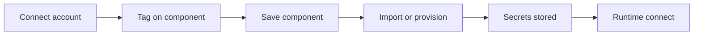

# Cloud linking

Connect a cloud account to your Ductape workspace **once**. Reference it by **tag** on any product component. Ductape imports or provisions the resource, stores credentials as workspace secrets, and refreshes them at runtime.

Supported providers: [AWS](./providers/aws), [GCP](./providers/gcp), [Azure](./providers/azure), [MongoDB Atlas](./providers/mongodb-atlas), [Neo4j Aura](./providers/neo4j-aura).

## How it works



| Step | What you do | Docs |
|------|-------------|------|
| **1. Connect** | Create a workspace cloud connection, add provider credentials, validate | [Cloud connections](./connections) |
| **2. Link** | Set `cloud: '<tag>'` and a resource name on a component env | [Link components](./cloud-linked-components) |
| **3. Run** | Use `ductape.databases.connect()`, `ductape.storage.upload()`, etc. — credentials resolve automatically | Component docs below |

## Connection tags

Every connection has a stable **tag** (for example `prod_aws`, `prod_gcp`). Use that tag everywhere — never an internal connection ID.

```ts
// On a database env
{ slug: 'prd', cloud: 'prod_aws', instance: 'my-app-db', region: 'us-east-1' }

// On low-level cloud APIs
await ductape.cloud.resources.list({ cloud: 'prod_aws', service: 's3', region: 'us-east-1' });
```

## What you can link

| Component | AWS | GCP | Azure | Atlas | Aura |
|-----------|-----|-----|-------|-------|------|
| Storage | S3 | GCS | Blob | — | — |
| Message brokers | SQS | Pub/Sub | Service Bus | — | — |
| Databases | RDS (PostgreSQL) | Cloud SQL | PostgreSQL Flexible | MongoDB cluster | — |
| Graphs | Neptune | Spanner Graph | Cosmos Gremlin | — | Aura instance |
| Vectors | OpenSearch | Vertex Vector Search | AI Search | — | — |

Provider setup and IAM/RBAC checklists live on each [provider page](./providers/aws).

## Workbench or SDK

Both paths do the same thing:

- **Workbench** — Cloud sidebar → add connection → link from the component editor when you save.
- **SDK** — `connections.create` → `connections.complete` → create/update component with `cloud` on the env.

## Next

1. [Set up a cloud connection](./connections)
2. [Link your first component](./cloud-linked-components)
3. [AWS networking](./aws-networking) — only if you use RDS or Neptune
