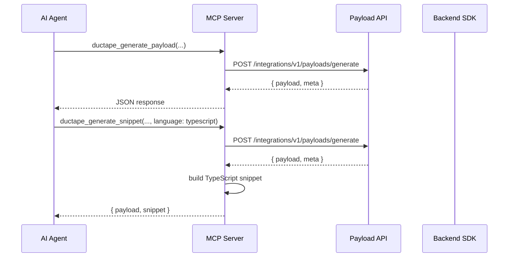

# Code generation

Two MCP tools help agents and copilots produce integration code without guessing payload shapes: `ductape_generate_payload` and `ductape_generate_snippet`.

Both call the Ductape backend at `POST /integrations/v1/payloads/generate`, authenticated with `x-access-key: <public_key>`.

---

## Feature



---

## Operation families

The `operation_family` argument groups SDK calls by component type. Each family maps to a specific SDK module path in generated snippets.

| `operation_family` | SDK module | Typical methods |
|--------------------|------------|-----------------|
| `action` | `actions` | `run`, `dispatch`, `execute` |
| `feature` | `feature` | `run`, `dispatch`, `execute` |
| `database` | `databases` | `dispatch`, `find`, `insert`, `update`, `delete`, `query`, `upsert`, `count`, `aggregate` |
| `graph` | `graph` | `dispatch`, `find`, `insert`, `update`, `delete`, `query`, `execute` |
| `vector` | `vector` | `query`, `find`, `findSimilar`, `upsert`, `insert`, `delete`, `dispatch` |
| `storage` | `storage` | `dispatch`, `upload`, `download`, `remove`, `listFiles`, `getSignedUrl`, `stats` |
| `notification` | `notifications` | `dispatch`, `send`, `email.send`, `push.send`, `sms.send`, `callback.send` |
| `messaging` | `messageBrokers` | `dispatch`, `send`, `publish`, `produce`, `consume` |
| `broker` | `messageBrokers` | Same as `messaging` |
| `quota` | `quotas` | `run`, `dispatch`, `check`, `consume` |
| `fallback` | `fallback` | `run`, `dispatch` |
| `healthcheck` | `health` | `run`, `check`, `status` |
| `health` | `health` | `run`, `check`, `status` |
| `session` | `sessions` | `start`, `verify`, `refresh`, `revoke`, `listActive` |
| `cache` | `caches` | `get`, `set`, `clear`, `clearAll`, `dispatch`, `fetchValues` |

If you call `ductape_generate_snippet` with an unsupported `operation_family.method` pair, the server returns an error listing allowed methods for that family.

---

## Supported snippet operations

Only these method names are valid for `ductape_generate_snippet`:

### `action`
`run`, `dispatch`, `execute`

### `feature`
`run`, `dispatch`, `execute`

### `database`
`dispatch`, `find`, `insert`, `update`, `delete`, `query`, `upsert`, `count`, `aggregate`

### `graph`
`dispatch`, `find`, `insert`, `update`, `delete`, `query`, `execute`

### `vector`
`query`, `find`, `findSimilar`, `upsert`, `insert`, `delete`, `dispatch`

### `storage`
`dispatch`, `upload`, `download`, `remove`, `listFiles`, `getSignedUrl`, `stats`

### `notification`
`dispatch`, `send`, `email.send`, `push.send`, `sms.send`, `callback.send`

### `messaging` / `broker`
`dispatch`, `send`, `publish`, `produce`, `consume`

### `quota`
`run`, `dispatch`, `check`, `consume`

### `fallback`
`run`, `dispatch`

### `healthcheck` / `health`
`run`, `check`, `status`

### `session`
`start`, `verify`, `refresh`, `revoke`, `listActive`

### `cache`
`get`, `set`, `clear`, `clearAll`, `dispatch`, `fetchValues`

---

## Schema modes

| Mode | Behavior |
|------|----------|
| `best_effort` (default) | Infer schema from available metadata; fill gaps with sensible defaults |
| `strict` | Require complete schema information; fail if metadata is insufficient |

Use `strict` when generating production code that must match exact component schemas. Use `best_effort` for exploration and prototyping.

---

## Targets

The optional `targets` object tells the payload API which component to target:

```json
{
  "targets": {
    "app": "stripe",
    "action": "create-customer"
  }
}
```

```json
{
  "targets": {
    "database": "main-db",
    "entity": "orders"
  }
}
```

```json
{
  "targets": {
    "vector": "embeddings-index"
  }
}
```

---

## Input hints

Pass partial input structure to guide payload generation:

```json
{
  "input_hint": {
    "entity": "users",
    "where": { "status": { "$eq": "active" } },
    "limit": 25
  }
}
```

The backend merges hints with component schema metadata to produce a canonical payload.

---

## Generated snippet format

### TypeScript

```typescript
import Ductape from "@ductape/sdk";

const ductape = new Ductape({
  workspace_id: process.env.DUCTAPE_WORKSPACE_ID!,
  user_id: process.env.DUCTAPE_USER_ID!,
  public_key: process.env.DUCTAPE_PUBLIC_KEY!,
});

async function run() {
  const payload = { /* generated template */ };
  const args = { /* flattened invocation args */ };
  const result = await ductape.actions.run(args);
  return { payload, result };
}

run().catch(console.error);
```

### Python

```python
from ductape import Ductape
import os
import json

ductape = Ductape(
    workspace_id=os.environ.get("DUCTAPE_WORKSPACE_ID"),
    user_id=os.environ.get("DUCTAPE_USER_ID"),
    public_key=os.environ.get("DUCTAPE_PUBLIC_KEY"),
)

def run():
    payload = { ... }
    args = { ... }
    result = ductape.actions.run(args)
    return {"payload": payload, "result": result}
```

The SDK call path is resolved automatically (e.g. `actions.run`, `databases.query`, `notifications.email.send`).

---

## CLI parity

The Ductape CLI provides equivalent commands:

```bash
ductape generate payload --help
ductape generate snippet --help
```

See [CLI generate](/cli/generate). The MCP tools expose the same backend API for agent-driven features.

---

## When to use which tool

| Scenario | Tool |
|----------|------|
| Agent needs payload shape only | `ductape_generate_payload` |
| Agent hands code to a developer | `ductape_generate_snippet` |
| Agent will execute immediately | `ductape_execute` (skip generation) |
| Exploring unknown component schema | `ductape_generate_payload` with `schema_mode: best_effort` |
| Production code scaffold | `ductape_generate_snippet` with `schema_mode: strict` |
