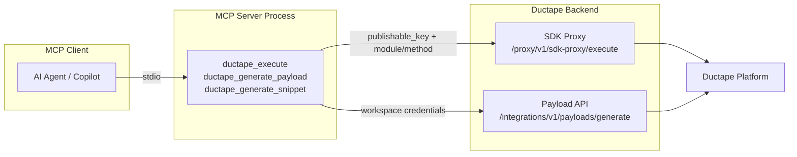

# Ductape MCP Server

The **Ductape MCP Server** is a [Model Context Protocol (MCP)](https://modelcontextprotocol.io/) server that exposes the full Ductape SDK as tools for AI agents and copilots. Connect it to Cursor, Claude Desktop, or any MCP-compatible client and let an LLM query databases, run actions, manage storage, orchestrate features, and more — without embedding the SDK in your agent process.

## What it does

| Capability | Description |
|------------|-------------|
| **SDK execution** | Call any allowed SDK module and method through the Ductape backend proxy |
| **Payload generation** | Produce canonical executable payload templates with schema metadata |
| **Code snippets** | Generate ready-to-copy TypeScript or Python SDK examples |

All operations go through `https://api.ductape.app`. The MCP process is **stateless** — it never loads the SDK locally and holds no workspace credentials between requests.

## Architecture

**Key properties:**

- **Stdio transport** — The server communicates over stdin/stdout. An MCP client spawns it as a child process.
- **Per-request authentication** — Every `ductape_execute` call requires a `publishable_key`. No keys are stored in the server process.
- **Proxy-enforced allowlist** — Only module/method pairs validated by the backend proxy can run. Unknown calls are rejected before execution.
- **No environment variables required** — The server starts with zero configuration; credentials are passed per tool invocation.

## When to use it

Use the MCP server when you want an AI agent to:

- **Operate your Ductape workspace** — Create products, connect apps, configure environments, manage components.
- **Run runtime operations** — Query databases, upsert vectors, upload files, send notifications, dispatch actions.
- **Build integration code** — Generate typed payloads and SDK snippets for engineers from natural-language intent.
- **Automate platform tasks** — Schedule jobs, manage sessions, check health probes, run quota/fallback chains.
- **Debug and inspect** — List resources, fetch dashboards, query logs, check job status.

You do **not** need the MCP server if you are writing application code directly with `@ductape/sdk`. Use the SDK in your backend; use MCP when an **external AI client** needs programmatic access to Ductape.

## Tools at a glance

| Tool | Purpose |
|------|---------|
| [`ductape_execute`](./tools#ductape_execute) | Run any allowed SDK operation |
| [`ductape_generate_payload`](./tools#ductape_generate_payload) | Generate canonical payload + schema metadata |
| [`ductape_generate_snippet`](./tools#ductape_generate_snippet) | Generate payload + TypeScript/Python snippet |

## Supported SDK modules

The server exposes **20 SDK modules** covering the full Ductape platform:

`product`, `app`, `databases`, `graph`, `webhooks`, `notifications`, `messageBrokers`, `storage`, `vector`, `caches`, `sessions`, `quotas`, `actions`, `features`, `jobs`, `logs`, `resilience`, `health`, `fallback`, `secrets`

See [Modules & methods](./modules-and-methods) for the complete allowlist and [Method reference](./method-reference) for parameter signatures.

## Documentation map

- [Getting started](./getting-started) — Install, build, and verify the server
- [Configuration](./configuration) — Cursor, Claude Desktop, and other MCP clients
- [Tools reference](./tools) — Arguments, responses, and examples for all three tools
- [Modules & methods](./modules-and-methods) — Allowed modules and method names
- [Method reference](./method-reference) — Exhaustive parameter signatures per method
- [Code generation](./code-generation) — Payload and snippet generation features
- [Use cases & possibilities](./use-cases) — What agents can accomplish across the platform
- [Security](./security) — Authentication model and multi-tenant safety

