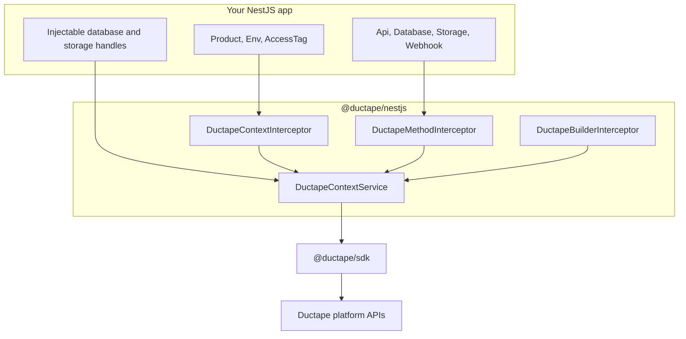

# @ductape/nestjs

:::info TypeScript only
`@ductape/nestjs` is a TypeScript/NestJS package. All code samples in this section are **TypeScript** — there are no Java, Go, or .NET tabs.
:::

The **`@ductape/nestjs`** package wraps [`@ductape/sdk`](/sdk) with NestJS modules, injectable handles, and decorators so you can call Ductape from controllers and services without manual SDK wiring.

## What it provides

| Capability | NestJS surface |
|------------|----------------|
| App actions | `@Api`, `@ApiDispatch`, `@ApiConfig` |
| Databases & storage | `@Database`, `@Storage` + feature modules |
| Webhooks | `@Webhook.Register`, `@Webhook.Consumer`, `@Webhook.List` |
| Events, features, jobs | `@Events.Produce`, `@Events.Dispatch`, `@Events.Consumer`, `@Feature.*`, `@Job.Run`, … |
| Agents, warehouse, sessions | `@Agent.*`, `@Warehouse.Query`, `@Session.*`, … |
| Resilience | `@Health.*`, `@Quota.*`, `@Fallback.*` |
| Workspace builders | `@WebhookBuilder.Define`, `@ModelBuilder.Define`, `@AgentBuilder.Define` |
| Context | `@Product`, `@Env`, `@AccessTag`, `@InjectContext` |

## Install

```bash
npm install @ductape/nestjs @ductape/sdk @nestjs/common @nestjs/core reflect-metadata rxjs
```

Peer dependency: **`@ductape/sdk` ≥ 0.1.12**, **NestJS 10 or 11**.

:::info Package status
`@ductape/nestjs` is at **0.1.0** in the monorepo. Install from the published package when available, or link locally from `sdk/nestjs` during development.
:::

## Architecture



- **Decorators with runtime behavior** (`@Api`, `@Webhook.Register`, messaging, agents, sessions, and related decorators) are executed by **`DuctapeMethodInterceptor`** (or **`DuctapeBuilderInterceptor`** in workspace mode).
- **Injectable handles** (`@Database('orders-db')`) resolve through **`DuctapeContextService`**, which respects `@Product` / `@Env` on the current HTTP request when set.
- Use **`ctx.sdk`** from `@InjectContext()` for SDK namespaces not yet wrapped (logs, cloud, …).

## Auth modes

| Mode | Module helper | SDK auth | Typical use |
|------|---------------|----------|-------------|
| **Integration** | `DuctapeModule.forIntegration()` | `accessKey` + default `product` / `env` | Customer apps, product integrators |
| **Workspace** | `DuctapeModule.forWorkspace()` | `accessKey` (workspace user context resolved by the SDK) | Admin tools, app/model/agent builders |

Integration mode covers `@Api`, `@Database`, `@Storage`, and `@Webhook.Register`.

Workspace mode is required for builder APIs (`ductape.webhooks.create`, `ductape.app.*`, model/agent admin).

## Database schema management

`@ductape/nestjs` provides the `@Database` decorator and injectable handles for querying databases at runtime. Schema management — creating tables, adding fields, running and tracking migrations — is handled separately via the CLI.

**The recommended workflow for NestJS projects:**

1. Declare your tables in `ductape/database/schema.json` at the root of your NestJS project
2. Run `ductape db schema generate` to produce version-controlled migration files
3. Run `ductape db migrate` (or `ductape db migrate --env prd`) to apply pending migrations before deploying

This keeps schema changes explicit, reviewable in pull requests, and applied in a controlled sequence across environments — independent of your NestJS application startup.

```bash
# From your NestJS project root (after ductape init / ductape link)
ductape db schema generate
ductape db migrate --env staging
ductape db migrate --env prd
```

:::tip
Add `ductape db migrate` to your CI/CD pipeline as a pre-deploy step. Because the migration engine tracks applied migrations in `_ductape_migrations`, running it multiple times is safe.
:::

See [CLI: Database runtime & migrations](/docs/cli/database) for the full schema.json format and command reference.

## Next steps

- [Getting started](./getting-started) — wire `DuctapeModule` and your first `@Api` handler
- [Module setup](./module-setup) — `forIntegration`, `forWorkspace`, feature modules
- [Context & handles](./context-and-handles) — `@Product`, `@Env`, `@InjectContext`, multi-tenant patterns
- [Core decorators](./decorators-core) — `@Api`, `@Database`, `@Storage`, `@Webhook`
- [Runtime decorators](./decorators-runtime) — messaging, features, agents, sessions, resilience
- [Workspace builders](./workspace-builders) — declarative webhook/model/agent definitions
- [Interceptors](./interceptors) — global vs per-controller registration
